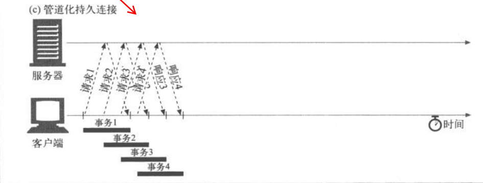

# http协议

>HTTP（HyperText Transport Protocol）是超文本传输协议的缩写，它用于传送WWW方式的数据，关于HTTP协议的详细内容请参考RFC2616。HTTP协议采用了请求/响应模型。客户端向服务器发送一个请求，请求头包含请求的方法、URL、协议版本、以及包含请求修饰符、客户信息和内容的类似于MIME的消息结构。服务器以一个状态行作为响应，响应的内容包括消息协议的版本，成功或者错误编码加上包含服务器信息、实体元信息以及可能的实体内容。 —— 百度百科《http协议-协议基础》

## http 请求流程

（对一个html页面访问）

1、浏览器向 DNS 服务器请求解析该 URL 中的域名所对应的 IP 地址;
2、解析出 IP 地址后，根据该 IP 地址和默认端口 80，和服务器建立TCP连接;
3、浏览器发出读取文件(URL 中域名后面部分对应的文件)的HTTP 请求，该请求报文作为 TCP 三次握手的第三个报文的数据发送给服务器;
4、服务器对浏览器请求作出响应，并把对应的 html 文本发送给浏览器;
5、释放 TCP连接;
6、浏览器将该 html 文本并显示内容; 

### http 协议主要特点

* **简单快速** *客户向服务器请求服务时，只需传送请求方法和路径。*
* **灵活** *HTTP允许通过Content-Type传输任意类型的数据对象*
* **无连接** *请求——应答后即断开连接*
* **无状态** *该协议对于事务处理没有记忆能力*

### http 报文的组成部分

==请求报文组成部分==

* 请求报文
  * **请求行** *请求方法，请求地址，http协议版本地址*
  * **请求头** *一些key:value组成的*
  * **空行** *区分请求头和请求头*
  * **请求体** *发送给服务端的一些信息*

==响应报文组成部分==

* 响应报文
  * **状态行** *http协议版本、响应状态码*
  * **响应头** *一些key:value组成的*
  * **空行** *区分请求头和请求头*
  * **响应体** *服务器返回的信息*

### http 方法

* get *获取资源*
* post *传输资源*
* head *获取报文首部*
* delete *删除资源*
* put *更新资源*

## GET和POST

* get请求在URL传参根据不同的浏览器会有不同的长度限制
* get请求可以在浏览器地址栏中直接访问
* get请求参数会有ASCII字符编码限制
* get请求参数暴露在url连接上，相对于post不安全
* get请求在浏览器回退时不会再次请求，post会再次请求

### http状态码

1xx：指示信息--表示请求已接收，继续处理
2xx：成功--表示请求已被成功接收、理解、接受
3xx：重定向--要完成请求必须进行更进一步的操作
4xx：客户端错误--请求有语法错误或请求无法实现
5xx：服务器端错误--服务器未能实现合法的请求

==常见状态码==

    200 OK                        //客户端请求成功
    206 Partial Content           //部分内容。服务器成功处理了部分GET请求
    301 Moved Permanently         //永久移动
    302 Found                     //临时移动
    304 Not Modified              //资源未修改
    400 Bad Request               //客户端请求有语法错误，不能被服务器所理解
    401 Unauthorized              //请求未经授权，这个状态代码必须和WWW-Authenticate报头域一起使用
    403 Forbidden                 //服务器收到请求，但是拒绝提供服务
    404 Not Found                 //请求资源不存在，eg：输入了错误的URL
    500 Internal Server Error     //服务器发生不可预期的错误
    503 Server Unavailable        //服务器当前不能处理客户端的请求，一段时间后可能恢复正常

### 什么是持久连接

>HTTP 协议采用“请求-应答”模式，当使用普通模式，既非“keep-alive”模式时，每个请求/应答客户和服务器都要新建一个连接，完成之后即可断开连接（HTTP协议为无连接协议）
> 当使用“Keep-alive”模式（又称持久连接，连接重用）时，Keep-alive功能使用客户端到服务端的连接有效，出现对服务器的后续请求时，keep-alive功能避免了建立和重新建立连接

### 什么是管线化

==keep-alive 持久连接==

==持久连接——管线化==

#### 文章参考

* [http协议——百度百科](https://baike.baidu.com/item/http/243074?fromtitle=%E8%B6%85%E6%96%87%E6%9C%AC%E4%BC%A0%E8%BE%93%E5%8D%8F%E8%AE%AE&fromid=8535513)

* [HTTP持久连接和如何正确地关闭HTTP连接](https://www.cnblogs.com/hapjin/p/5815368.html?utm_source=itdadao&utm_medium=referral)

* [关于HTTP协议，一篇就够了](https://www.cnblogs.com/ranyonsue/p/5984001.html)