# 前端项目上传github Jenkins自动打包部署 node

这里我用的是阿里云的服务器为例

首先安装git 和 java

```shell
yum install java
yun install git
```

接下来安装 Jenkins （先添加Jenkins源）

```shell
wget -O /etc/yum.repos.d/jenkins.repo http://pkg.jenkins-ci.org/redhat/jenkins.repo
rpm --import https://jenkins-ci.org/redhat/jenkins-ci.org.key
```

安装

```shell
yum install Jenkins
```

启动

```shell
service jenkins restart
```

打开ip+端口（默认是8080端口），就进入Jenkins解锁页面了，这里需要密码解锁，不过有提示密码在什么位置/var/lib/jenkins/secrets/initialAdminPassword

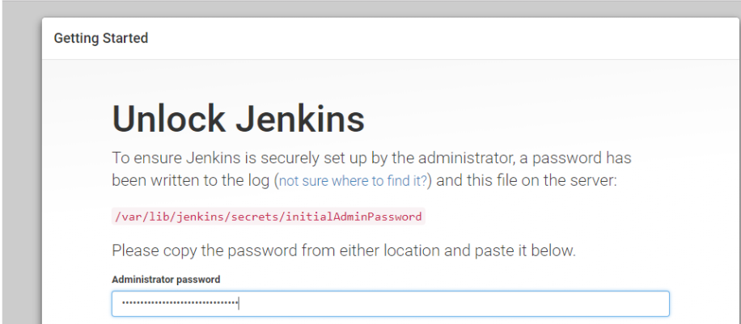

我们进入`vim /var/lib/jenkins/secrets/initialAdminPassword` 这个文件 复制出密码输入

出现这个页面
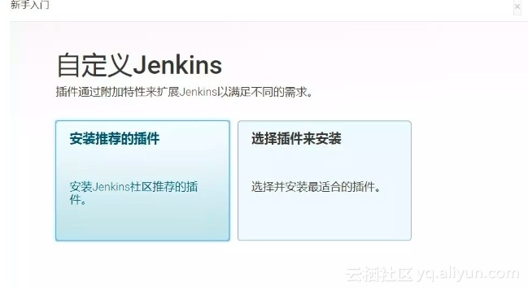

我们选择安装推荐

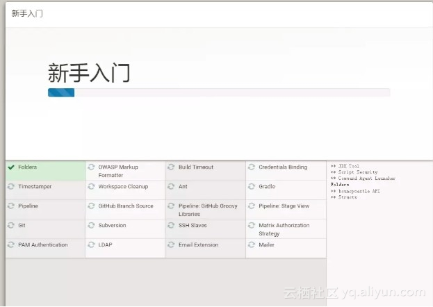

安装完成后我们需要创建一个账户


创建完成后我们开始使用jenkins了

## github 配置

进去github项目仓库->setting->webhook->add webhook -> playload URL 添入地址（后面的github-webhook是固定了）->保存

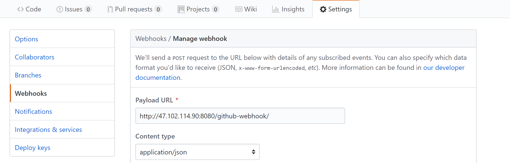

## 我们先配置下node

在首页系统管理->全局工具配置

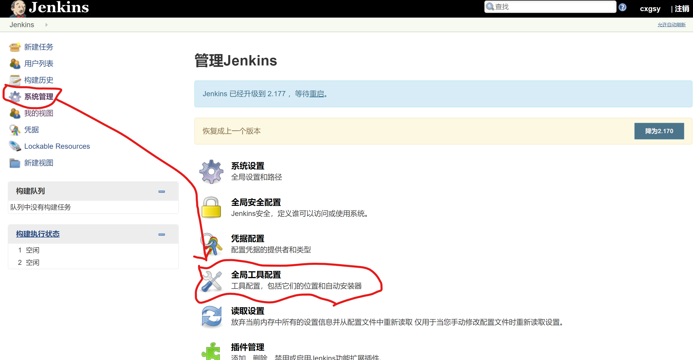

在全局工具配置下面有个node配置，我这里选择的是10.15.3的版本，点击保存

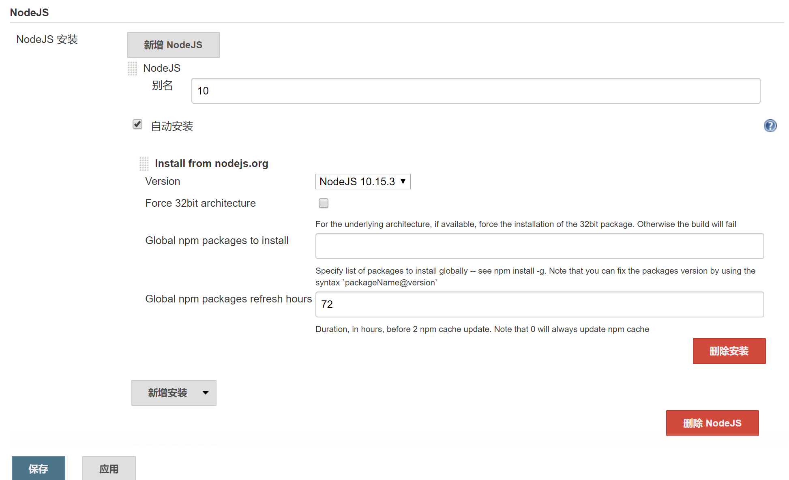

## 创建一个任务

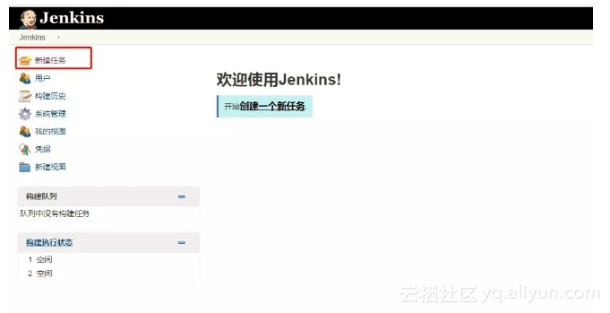

我们选择第一个（构建一个自由风格的项目）

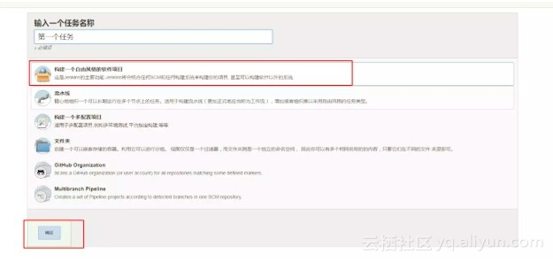

### 配置

描述随便写，github项目这里写github项目地址

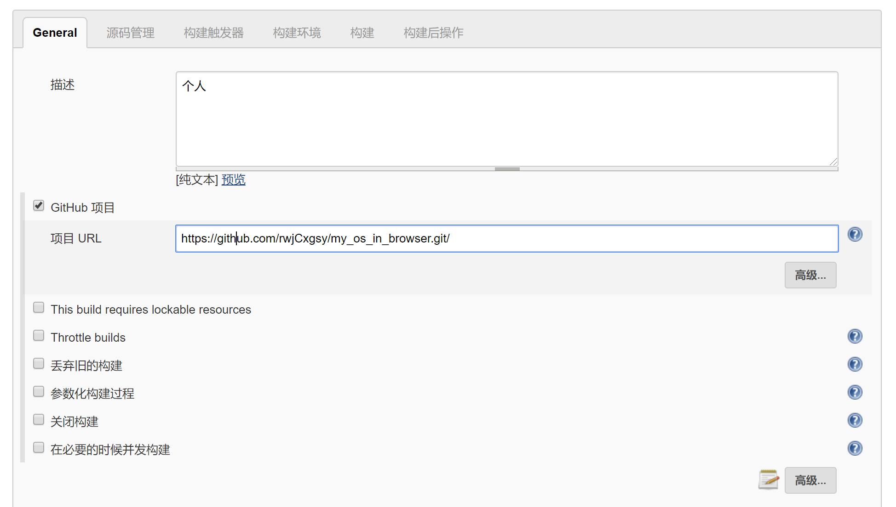

这里选择git，还是填写github仓库地址

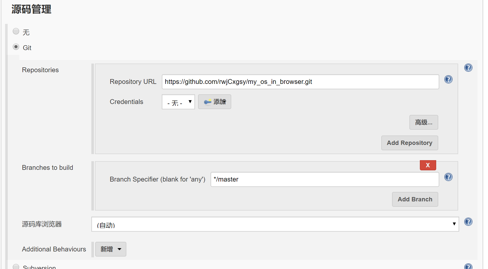

构建触发器==选择github hook trigger for GitScm poliing==
构建环境 选择图中哪一项，这里是之前node版本配置那个

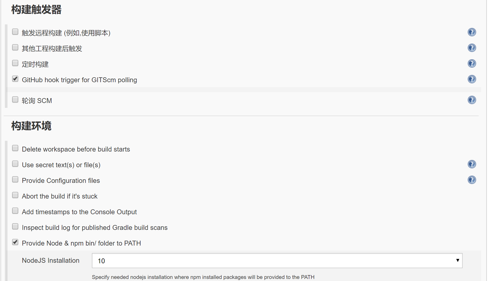

构建->增加构建步骤->执行shell->输入你要执行了命令
构建完成操作 （我选择的是发送邮件通知）

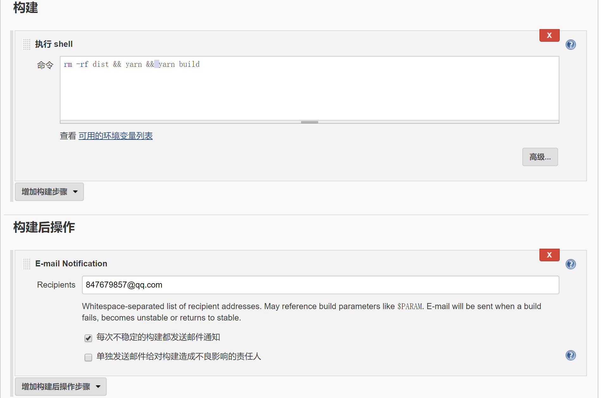

### 参考文章

部分图片来自于
[Jenkins +nginx 搭建前端构建环境](https://juejin.im/post/5b371678f265da599f68dfa2?spm=a2c4e.11153940.blogcont606825.13.ad6b5c38xI9uZq)